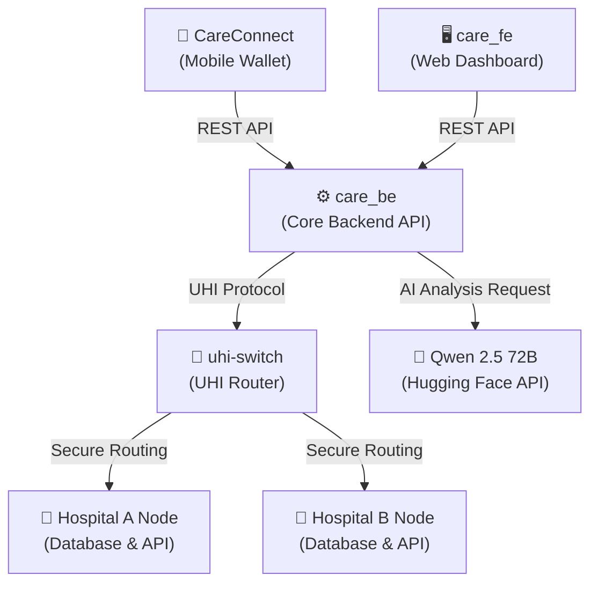

# CARE: Unified Health Ecosystem

CARE is a comprehensive, decentralized health information ecosystem designed to securely manage, share, and analyze patient medical records across multiple healthcare providers. It leverages a mobile wallet for patient empowerment, an AI-powered backend for clinical insights, and a unified health interface (UHI) for interoperability between hospital systems.

---

## 🏗️ System Architecture

The ecosystem consists of several interconnected components:



### 1. CareConnect (Mobile Health Wallet)
**Tech Stack:** Flutter, Dart, BLoC Pattern
A patient-facing mobile application that acts as a digital health wallet. 
- **Features:**
  - Securely store and view medical records, prescriptions, and lab reports.
  - Manage consent for sharing medical data with different providers.
  - Request AI-generated medical summaries and clinical insights.
  - Switch between different health record sources (e.g., Hospital A vs Hospital B).

### 2. care_be (AI-Powered Core Backend)
**Tech Stack:** Python, FastAPI, MongoDB, Hugging Face `huggingface_hub`
The central backend service that provides API endpoints for the mobile app and orchestrates AI analysis.
- **Features:**
  - FHIR-compliant patient record parsing and management.
  - Integration with **Qwen 2.5 72B Instruct** via Hugging Face Inference API for generating clinical summaries, extracting ICD codes, and highlighting critical alerts.
  - Automated mock data generation and seeding for testing.

### 3. Simulated Hospital Networks (`CARE/hospital-a` & `CARE/hospital-b`)
**Tech Stack:** Docker, Python
Containerized, independent hospital environments designed to demonstrate decentralized health record sharing.
- **Features:**
  - Each hospital runs its own isolated database and API service.
  - Simulates real-world interoperability where a patient's records are distributed across multiple providers.

### 4. UHI Switch (`uhi-switch`)
**Tech Stack:** Python
The Unified Health Interface (UHI) router.
- **Features:**
  - Acts as the central gateway to route requests securely between the CareConnect wallet and the various decentralized hospital networks.

### 5. care_fe (Web Dashboard)
**Tech Stack:** React, TypeScript, Vite
A comprehensive web frontend interface for hospital administrators and doctors to manage patients, queues, inventory, and activity definitions.

---

## 🚀 Getting Started

### Prerequisites
- **Docker & Docker Compose** (for running hospital nodes and databases)
- **Flutter SDK** (for building the CareConnect mobile app)
- **Python 3.10+** (for running the backend services locally if not using Docker)
- **Hugging Face Token** (required for the AI analysis features)

### 1. Environment Configuration

You must configure the `.env` files in the respective directories with your Hugging Face token to enable the AI features.

**CareConnect Mobile App:**
Create `CareConnect/.env`:
```env
HUGGING_FACE_TOKEN=your_huggingface_token_here
```

**Hospital Nodes:**
Create `CARE/hospital-a/.env` and `CARE/hospital-b/.env`:
```env
HF_TOKEN=your_huggingface_token_here
```

**Core Backend:**
Create `care_be/.env`:
```env
HF_TOKEN=your_huggingface_token_here
```

### 2. Launching the Hospital Networks

The hospital networks are fully dockerized. To spin them up, navigate to each directory and run Docker Compose:

```bash
# Start Hospital A
cd CARE/hospital-a
docker compose up -d --build

# Start Hospital B
cd CARE/hospital-b
docker compose up -d --build
```
This will expose the hospital APIs on ports `4001` and `4002`.

### 3. Building the CareConnect Mobile App

The mobile app relies on Dart's `build_runner` to securely inject the environment variables.

```bash
cd CareConnect
flutter clean
flutter pub get
dart run build_runner build --delete-conflicting-outputs
flutter build apk --release
```
Once the build is complete, the APK will be available at `CareConnect/build/app/outputs/flutter-apk/app-release.apk`.

### 4. Running the Core Backend locally (Optional)

If you need to run `care_be` locally outside of Docker for development:
```bash
cd care_be
python -m venv .venv
source .venv/bin/activate
pip install -r requirements.txt
./run.sh
```

---

## 🤖 AI Model Configuration

The ecosystem utilizes the Hugging Face Serverless Inference API. The system is currently configured to use **Qwen/Qwen2.5-72B-Instruct**, providing state-of-the-art reasoning for clinical data analysis.

If you wish to change the model, update the model string in `care_be/medgemma_ai.py` and restart the services.

---

## 🛡️ Security & Privacy
- All API keys and tokens are excluded from version control via `.gitignore`.
- Mobile environment variables are obfuscated at compile time using the `envied` package.
- Health records conform to FHIR (Fast Healthcare Interoperability Resources) standards to ensure secure and standardized data exchange.
